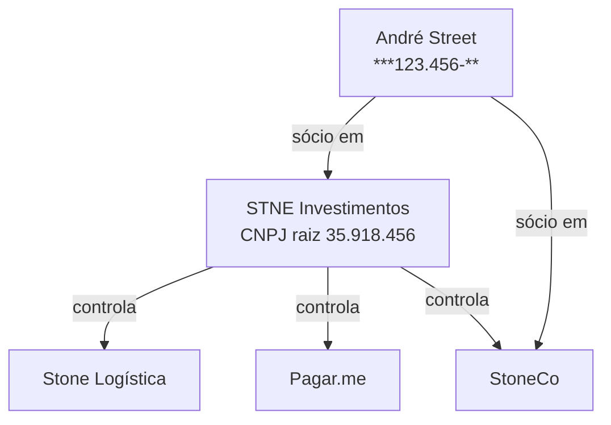

# Artifacts, Visuais Customizados e Workflow Investigativo

Como entregar respostas mais úteis usando os formatos visuais do Claude (Artifacts persistentes, Custom Visuals inline) e fazendo o usuário acompanhar o raciocínio passo a passo.

> Refs oficiais Anthropic: [Artifacts](https://support.claude.com/en/articles/9487310-what-are-artifacts-and-how-do-i-use-them) · [Custom Visuals](https://support.claude.com/en/articles/13979539-custom-visuals-in-chat-and-cowork)

---

## 1. Três níveis de resposta — qual usar quando

### Nível 1: **Tabela markdown inline** (default)

Resposta direta, ≤15 linhas, single-shot. **80% dos casos**.

```
**3 empresas com sócio "Bruno Cardoso" no CNAE 4711-3 (varejo alimentar):**

| CNPJ | Razão Social | UF | Município | Qualificação |
|---|---|---|---|---|
| 12.345.678/0001-90 | SUPERMERCADO X LTDA | SP | São Paulo | Sócio-Administrador |
| ... | ... | ... | ... | ... |
```

**Use quando**:
- 1 pergunta → 1 resposta
- Resultado cabe em 1-2 telas
- Não há análise multi-dimensional
- Usuário pediu dado bruto

### Nível 2: **Custom Visual** (HTML inline efêmero)

Visual gerado inline na resposta — flowcharts, gráficos pequenos, comparações lado a lado, diagramas conceituais. Bom pra **enriquecer raciocínio em uma resposta única**.

**Use quando**:
- O dado se entende melhor com forma visual (mapa, gráfico, hierarquia)
- A pergunta é one-off — usuário não vai voltar e iterar nesse visual
- ≤30 linhas de HTML/CSS (flowchart simples, gráfico pequeno)
- Comparativo simples lado a lado (2-3 empresas)

**Não use quando**:
- O dado é tabular plano (use tabela markdown)
- A complexidade já justifica artifact (>50 linhas de código, dashboard com 3+ painéis)

### Nível 3: **Artifact** (persistente, side panel)

Side panel que o usuário pode editar, baixar (.html/.svg), compartilhar. **Pra entregas que valem ser preservadas**.

**Use quando** (qualquer um dos critérios):
- Resposta tem >15 linhas substantivas e o usuário vai querer **referenciar depois**
- **Dashboard de empresa**: perfil + filiais + métricas + comparações em uma tela
- **Relatório consolidado**: resultado de investigação multi-passo
- **Visualização interativa** com filtros/ordenação (React component)
- **Comparativo formal** entre 3+ entidades
- Usuário pediu explicitamente algo "pra apresentar/baixar/compartilhar"

**Tipos de artifact úteis pra esse skill**:

| Tipo | Quando |
|---|---|
| **Markdown** (`text/markdown`) | Relatório textual longo (perfil de empresa, dossiê societário) |
| **HTML** (`text/html`) | Dashboard estático com tabelas + gráficos CSS |
| **React component** (`application/vnd.ant.react`) | Dashboard interativo com filtros, ordenação, gráficos (Recharts) |
| **SVG** (`image/svg+xml`) | Mapa/diagrama estático (rede societária, fluxograma) |
| **Mermaid** (`application/vnd.ant.mermaid`) | Hierarquia, sequência, fluxo (rede de sócios PJ) |

---

## 2. Bibliotecas disponíveis em React artifacts

Quando criar artifact React, estas libs estão pré-instaladas e podem ser importadas direto:

```js
// Gráficos
import { BarChart, Bar, LineChart, Line, PieChart, Pie, XAxis, YAxis, Tooltip, ResponsiveContainer } from 'recharts';

// Estilo
// Tailwind CSS classes (sem import — apenas use className="...")

// Ícones
import { MapPin, Building2, Users, TrendingUp, AlertTriangle } from 'lucide-react';

// UI primitives (shadcn/ui-like)
import { Card, CardHeader, CardTitle, CardContent } from '@/components/ui/card';
import { Table, TableHeader, TableBody, TableRow, TableCell } from '@/components/ui/table';
```

**Regras**:
- React artifacts usam Tailwind por padrão. NÃO importe CSS externo.
- Use `useState` pra filtros/ordenação no próprio artifact.
- Default export do componente principal.
- Não fetch externo — todos os dados precisam vir como constantes no artifact (não há acesso a BQ de dentro do artifact).

---

## 3. Templates pra casos comuns CNPJ + PAT

### Template A — Dashboard de empresa (Artifact React)

Cenário: usuário pergunta "me dá um perfil completo da Ambev no PAT". Resposta = 1 artifact React com:
- Header com razão social, CNPJ raiz, porte, capital, idade
- Card de métricas (unidades, trabalhadores, folha estimada, UFs)
- Gráfico de barras: top 10 cidades por trabalhadores
- Tabela paginada de filiais
- Disclaimer da heurística de folha

```jsx
// Esqueleto:
import { BarChart, Bar, XAxis, YAxis, ResponsiveContainer, Tooltip } from 'recharts';
import { Building2, Users, MapPin, DollarSign } from 'lucide-react';

const empresa = {
  razao_social: 'AMBEV S.A.',
  cnpj_basico: '07526557',
  porte: 'DEMAIS',
  capital: 87_100_000_000,
  idade: 83,
  unidades: 75,
  trabalhadores: 24_874,
  folha_mi: 158.79,
  ufs: 20,
  municipios: 63,
};

const cidadesTop = [
  { cidade: 'SAO PAULO', trab: 2492, folha_mi: 25.19 },
  { cidade: 'JAGUARIUNA', trab: 2306, folha_mi: 17.25 },
  // ...
];

export default function EmpresaDashboard() {
  return (
    <div className="p-6 max-w-5xl mx-auto bg-slate-50 min-h-screen">
      <header className="mb-6">
        <h1 className="text-3xl font-bold text-slate-900">{empresa.razao_social}</h1>
        <p className="text-slate-600">CNPJ raiz {empresa.cnpj_basico} · {empresa.porte} · {empresa.idade} anos</p>
      </header>

      <div className="grid grid-cols-4 gap-4 mb-6">
        <MetricCard icon={Building2} label="Unidades PAT" value={empresa.unidades} />
        <MetricCard icon={Users} label="Trabalhadores" value={empresa.trabalhadores.toLocaleString('pt-BR')} />
        <MetricCard icon={DollarSign} label="Folha estimada/mês" value={`R$ ${empresa.folha_mi} mi`} />
        <MetricCard icon={MapPin} label="UFs / Municípios" value={`${empresa.ufs} / ${empresa.municipios}`} />
      </div>

      <Card title="Top 10 cidades por trabalhadores">
        <ResponsiveContainer width="100%" height={300}>
          <BarChart data={cidadesTop}>
            <XAxis dataKey="cidade" angle={-30} textAnchor="end" height={70} />
            <YAxis />
            <Tooltip />
            <Bar dataKey="trab" fill="#0891b2" />
          </BarChart>
        </ResponsiveContainer>
      </Card>

      <p className="text-xs text-slate-500 mt-4">
        ⚠️ Folha estimada usa heurística 3SM/8SM (SM 2025 = R$ 1.518). Pra valores absolutos, cruzar com BDC/RAIS/CAGED.
      </p>
    </div>
  );
}
```

### Template B — Funil investigativo (Custom Visual inline)

Cenário: usuário fez pergunta investigativa multi-passo. Mostre **inline** o que filtrou em cada etapa antes da resposta final.

```html
<!-- Estilo simples HTML+CSS, sem React, ~25 linhas -->
<div style="font-family: system-ui; max-width: 600px;">
  <h3 style="color: #0f172a;">Funil — sócio "Bruno Cardoso" no varejo alimentar SP</h3>
  <div style="display: flex; flex-direction: column; gap: 8px;">
    <div style="background: #e0f2fe; padding: 12px; border-radius: 8px;">
      <strong>Universo</strong><br>
      Empresas no CNAE 4711-3 (varejo alimentar) ativas em SP: <strong>14.523</strong>
    </div>
    <div style="background: #bae6fd; padding: 12px; border-radius: 8px; margin-left: 24px;">
      <strong>Filtro 1</strong> — sócio com primeiro nome "Bruno": <strong>225</strong>
    </div>
    <div style="background: #7dd3fc; padding: 12px; border-radius: 8px; margin-left: 48px;">
      <strong>Filtro 2</strong> — "Bruno Cardoso" exato: <strong>3</strong>
    </div>
    <div style="background: #38bdf8; padding: 12px; border-radius: 8px; margin-left: 72px; color: white;">
      <strong>Resultado</strong> — todas em SP capital, 2 com mesma máscara CPF (***456789**)
    </div>
  </div>
</div>
```

### Template C — Comparativo (Artifact React)

Cenário: "compare Ambev e BRF no PAT". 2-3 cards lado a lado com mesmas métricas.

```jsx
const empresas = [
  { nome: 'AMBEV S.A.', unidades: 75, trab: 24_874, folha_mi: 158.79, pct_baixa: 76.1 },
  { nome: 'BRF S.A.', unidades: 198, trab: 101_080, folha_mi: 460.5, pct_baixa: 95.0 },
];

export default function Comparativo() {
  return (
    <div className="grid grid-cols-2 gap-4 p-6">
      {empresas.map(e => (
        <Card key={e.nome}>
          <CardHeader><CardTitle>{e.nome}</CardTitle></CardHeader>
          <CardContent>
            <Metric label="Unidades" value={e.unidades} />
            <Metric label="Trabalhadores" value={e.trab.toLocaleString('pt-BR')} />
            <Metric label="Folha/mês" value={`R$ ${e.folha_mi} mi`} />
            <Metric label="% baixa renda" value={`${e.pct_baixa}%`} />
          </CardContent>
        </Card>
      ))}
    </div>
  );
}
```

### Template D — Mapa de filiais (Artifact SVG)

Pra visualização espacial do Brasil com UFs marcadas. SVG estático com classes Tailwind embutidas via `style`. Útil pra "Ambev no Brasil — 20 UFs".

```svg
<!-- Mapa simplificado: bolha por UF dimensionada por nº de trabalhadores -->
<svg viewBox="0 0 600 600" xmlns="http://www.w3.org/2000/svg">
  <!-- Se tiver lib de mapa BR disponível, use; senão posicione manualmente -->
  <circle cx="280" cy="380" r="40" fill="#0891b2" opacity="0.7"/>
  <text x="280" y="385" text-anchor="middle" fill="white" font-size="11">SP 11.132</text>
  <!-- ... outras UFs ... -->
</svg>
```

### Template E — Rede societária (Artifact Mermaid)

Cenário: usuário quer ver o conglomerado de uma holding via QSA.



---

## 4. Workflow investigativo step-by-step

Boa investigação CNPJ/PAT é **iterativa** (ver `05-playbook-investigacao.md`). O usuário ganha visibilidade ao acompanhar:

### Padrão recomendado:

```
Vou investigar em 3 passos:
1. Descobrir códigos CNAE de "varejo alimentar"
2. Filtrar empresas ativas em SP nesse CNAE
3. Cruzar com sócios chamados "Bruno Cardoso"

[Passo 1] Encontrei 4 códigos CNAE relevantes:
| CODIGO | DESCRICAO |
|---|---|
| 4711-3/01 | Hipermercados |
| 4711-3/02 | Supermercados |
| 4712-1/00 | Mercearias |
| 4789-0/05 | Comércio varejista de mercadorias diversas |

[Passo 2] 14.523 empresas ativas em SP nesses CNAEs.

[Passo 3] 225 com sócio cujo primeiro nome é "Bruno".

**Resultado: 3 empresas com sócio "Bruno Cardoso" exato** (tabela abaixo).

[Tabela markdown ou Artifact com detalhe]
```

### Quando elevar pra Artifact

Se ao final do funil a tabela tem **>15 linhas** OU o usuário pediu "perfil completo" / "vou apresentar" / "compare" / "exporte" → criar artifact.

Se for **3 linhas**, deixe inline mesmo.

### Sinais que pedem artifact mesmo em respostas curtas

- "Me dá um dossiê / perfil / overview de [empresa]"
- "Compare X com Y"
- "Quero ver as filiais [num mapa / dashboard]"
- "Exporta pra mim isso"
- "Apresenta isso pro time"
- Pergunta com 4+ dimensões (porte × CNAE × UF × sócios)

---

## 5. Anti-padrões — não faça

❌ **Artifact pra 1 número**: "Ambev tem 24.874 trabalhadores" não merece artifact.

❌ **Visual sem dado bruto**: nunca substitua a tabela pelo gráfico — quem quer copiar dado precisa do source. Inclua tabela acessível **junto** do gráfico no artifact.

❌ **React artifact com 50+ entidades hardcoded**: se passar de 50 itens, paginar ou ofereça download CSV inline antes.

❌ **Mermaid pra 2 nós**: usa lista markdown.

❌ **Mapa SVG estático com >27 UFs sem motivo**: se não há diferença visual significativa, mostre tabela ordenada por UF.

❌ **Artifact com cores aleatórias por categoria**: use paleta consistente (azul Tailwind `slate`/`cyan`, vermelho pra alertas, verde pra confirmações).

❌ **Esquecer de mencionar a heurística de folha**: sempre que `folha_mensal_estimada_brl` aparecer no visual, incluir disclaimer ⚠️.

---

## 6. Quando o usuário pede artifact e não temos dado pronto

Se a pergunta exige cruzamento que ainda não foi rodado:

1. **Não invente** dado pra preencher o artifact.
2. Rode a query primeiro, mostre o resultado bruto inline.
3. Pergunte se quer formato visual: *"Quer que eu monte isso num dashboard navegável (artifact) ou tabela bruta basta?"*
4. Só então construa o artifact com dados reais.

---

## 7. Padrão de cores / acessibilidade

Sugestão de paleta pra dashboards (consistência entre artifacts do mesmo skill):

| Categoria | Tailwind |
|---|---|
| Métrica primária | `bg-slate-900 text-white` |
| Métrica secundária | `bg-slate-100 text-slate-900` |
| Destaque positivo | `bg-emerald-100 text-emerald-900` |
| Alerta / divergência | `bg-amber-100 text-amber-900` |
| Erro / zumbi | `bg-rose-100 text-rose-900` |
| Gráfico fill (barra/linha primária) | `#0891b2` (cyan-700) |
| Gráfico fill secundário | `#475569` (slate-600) |

Acessibilidade:
- Sempre incluir `aria-label` em ícones decorativos (ou `aria-hidden="true"` se puramente decorativos)
- Textos com contraste mínimo AA (WCAG)
- Tabelas com `<caption>` em SVG/HTML
- Não usar cor sozinha pra transmitir info (sempre acompanhar de label)

---

## 8. Tabela-resumo: quando criar o quê

| Situação | Formato |
|---|---|
| 1 número, 1 frase | Inline texto |
| 2-15 linhas tabular | Tabela markdown inline |
| Funil investigativo (3-4 passos) | Tabelas markdown inline + Custom Visual no fim se valer |
| Comparativo 2-3 empresas, métricas iguais | Custom Visual inline OU Artifact React (se ≥3 dimensões) |
| Comparativo 4+ empresas | **Artifact** React com cards ou tabela ordenável |
| Perfil completo de empresa | **Artifact** React (dashboard) |
| Mapa de filiais | Custom Visual SVG (≤30 UFs) ou Artifact React |
| Rede societária / hierarquia | **Artifact** Mermaid |
| Dossiê textual longo | **Artifact** Markdown |
| Relatório com tabela + gráficos + análise | **Artifact** HTML ou React |
| Algo "pra baixar/exportar/apresentar" | **Artifact** sempre |
